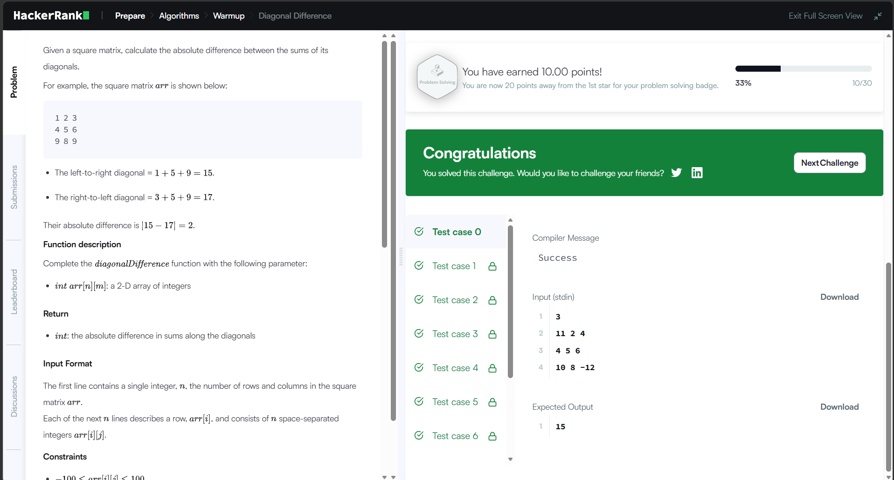
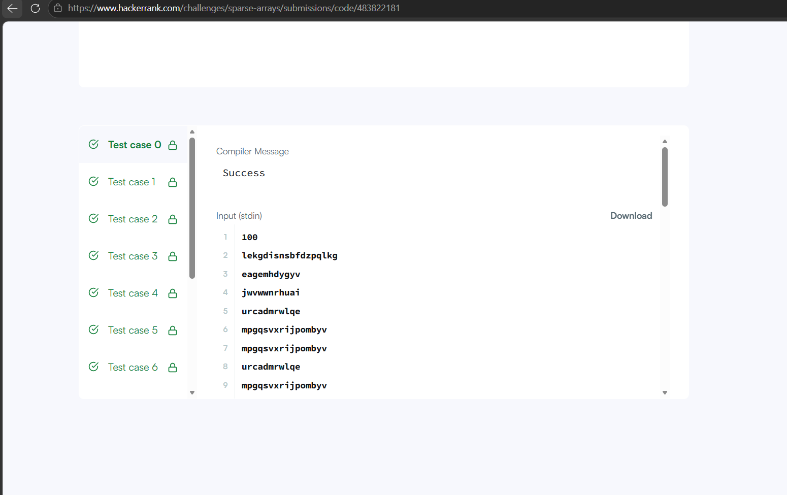

# HackerRank 3rd Sem Portfolio

## HackerRank Profile

[My HackerRank Profile](https://www.hackerrank.com/profile/pranavarun2007)

## Problems Solved

1. Diagonal Difference
2. Dynamic Array
3. Time Conversion
4. Compare the Triplets
5. Sparse Arrays

## Complexity Analysis

| Problem | Time Complexity | Space Complexity |
|---|---|---|
| Diagonal Difference | O(N) | O(1) |
| Dynamic Array | O(N + Q) | O(N) |
| Time Conversion | O(1) | O(1) |
| Compare the Triplets | O(1) | O(1) |
| Sparse Arrays | O(N + Q) | O(N) |

## Source Code

- [Diagonal Difference](Diagonal-Difference/solution.c)
- [Dynamic Array](Dynamic-Array/solution.c)
- [Time Conversion](Time-Conversion/solution.c)
- [Compare the Triplets](Compare-the-Triplets/solution.c)
- [Sparse Arrays](Sparse-Arrays/solution.c)

## HackerRank Accepted Submissions

### Diagonal Difference

### Dynamic Array

### Time Conversion

### Compare the Triplets

### Sparse Arrays

## HackerRank Badge

